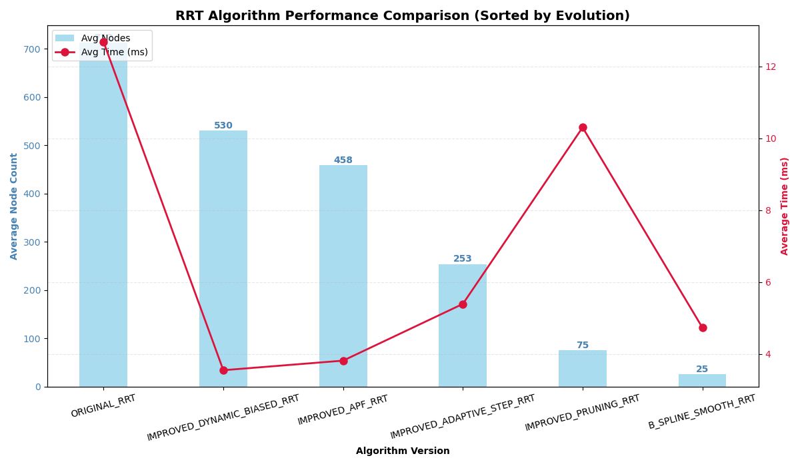
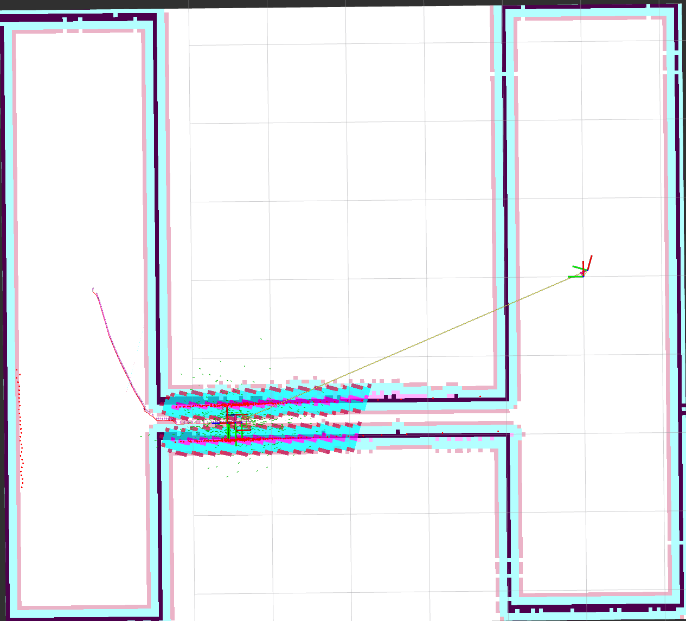
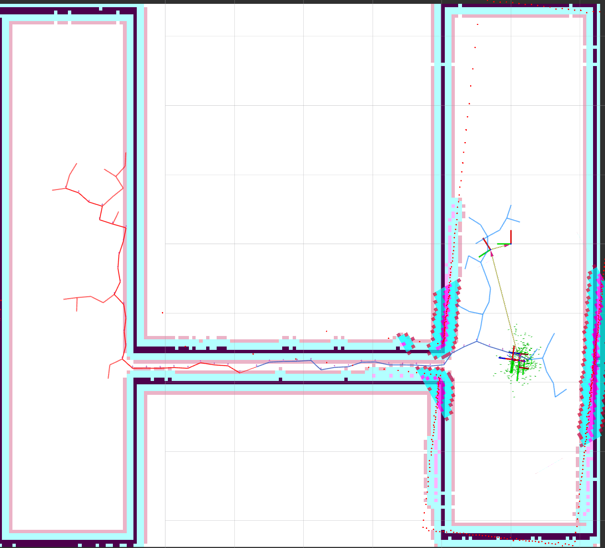

# 基于 ROS 2 和 Navigation 2 自动巡检机器人

## 1.项目介绍

本项目基于 ROS 2 和  Navigation 2 设计了一个自动巡检机器人仿真功能。

该巡检机器人要能够在不同的目标点之间进行循环移动，每到达一个目标点后首先通过语音播放到达的目标点信息，接着通过摄像头采集一张实时的图像并保存到本地。

各功能包功能如下：
- fishbot_description 机器人描述文件，包含仿真相关配置
- fishbot_navigation2 机器人导航配置文件
- fishbot_application 机器人导航应用 Python 代码
- fishbot_application_cpp 机器人导航应用 C++ 代码
- autopatrol_interfaces  自动巡检相关接口
- autopatrol_robot  自动巡检实现功能包
- nav2_custom_planners  自定义导航规划器插件

## 2.使用方法

本项目开发平台信息如下：

- 系统版本： Ubunt22.04
- ROS 版本：ROS 2 Humble

### 2.1安装

本项目建图采用 slam-toolbox，导航采用 Navigation 2 ,仿真采用 Gazebo，运动控制采用 ros2-control 实现，构建之前请先安装依赖，指令如下：

1. 安装 SLAM 和 Navigation 2

```
sudo apt install ros-$ROS_DISTRO-nav2-bringup ros-$ROS_DISTRO-slam-toolbox
```

2. 安装仿真相关功能包

```
sudo apt install ros-$ROS_DISTRO-robot-state-publisher  ros-$ROS_DISTRO-joint-state-publisher ros-$ROS_DISTRO-gazebo-ros-pkgs ros-$ROS_DISTRO-ros2-controllers ros-$ROS_DISTRO-xacro
```

3. 安装语音合成和图像相关功能包

```
sudo apt install python3-pip  -y
sudo apt install espeak-ng -y
sudo pip3 install espeakng
sudo apt install ros-$ROS_DISTRO-tf-transformations
sudo pip3 install transforms3d
```

### 2.2运行

安装完成依赖后，可以使用 colcon 工具进行构建和运行。

构建功能包

```
colcon build
```

运行仿真

```
source install/setup.bash
ros2 launch fishbot_description gazebo_sim.launch.py
```

运行导航

```
source install/setup.bash
ros2 launch fishbot_navigation2 navigation2.launch.py
```

运行自动巡检

```
source install/setup.bash
ros2 launch autopatrol_robot autopatrol.launch.py
```

运行planner_server以显示错误
```
ros2 run nav2_planner planner_server --ros-args --params-file /home/lrm/chapt8/chapt8_ws/src/fishbot_navigation2/config/nav2_params.yaml
```

### 2.3扫图
在功能包fishbot_gazebo_sim中的gazebo_sim.launch.py中修改参数（将要扫图的.world文件路径替换）
```
    default_gazebo_world_path = os.path.join(urdf_package_path,'world','narrow_corridor.world')
```

扫图完成后会在当前目录下生成一个map.pgm和map.yaml文件，分别是地图图像和地图元数据文件。将它们移动到fishbot_navigation2的maps目录下，并修改nav2_params.yaml中的地图路径参数：

```
  map_server:
    ros__parameters:
      yaml_filename: "/home/lrm/BISHE_WS/src/fishbot_navigation2/maps/map.yaml"
```

启动fishbot_navigation2导航功能包中的slam_rviz2.launch.py手动操控扫图
```
ros2 launch fishbot_navigation2 slam_rviz2.launch.py
```

扫图结束后在改路径：~/BISHE_WS/src/fishbot_navigation2/maps下输入：
```
ros2 run nav2_map_server map_saver_cli -f ${文件名}
```
即可生成地图文件（.pgm和.yaml）。

### 2.4自定义导航规划器

本项目在 Navigation 2 的基础上实现了多个基于 RRT 算法的自定义导航规划器插件，分别是：

- RRTOriginPlanner（最原始的RRT算法）
- RRTDynamicBiasedPlanner（动态偏置RRT算法）
- RRTAPFPlanner（APF规划器）
- RRTAdaptivePlanner（自适应步长RRT规划器）
- RRTPruningPlanner（RRT剪枝规划器）
- RRTBSplineSmoothPlanner（B样条RRT规划器）
- RRTConnectPlanner（RRT Connect规划器（为窄通道而生））


如果插件注册成功可以在/home/lrm/BISHE_WS/install/nav2_custom_planner/lib中查看插件文件。

### 2.5各个插件在房间中的性能比较
先运行gazebo仿真环境：
```
ros2 launch fishbot_description gazebo_sim.launch.py
```

运行导航并收集日志信息：
```
ros2 launch fishbot_navigation2 navigation2.launch.py >${插件名}.log 
```

运行性能信息比较脚本log_analyzer.py从而获得性能比较图（包括节点数和耗时）
```
python3 log_analyzer.py 
`````



### 2.6创建自定义导航规划器插件
1. 创建插件类，继承 nav2_core::GlobalPlanner，并实现其中的纯虚函数：

```
class RRTOriginPlanner : public nav2_core::GlobalPlanner
{
public:
    RRTOriginPlanner() = default;
    ~RRTOriginPlanner() = default;
};
```   
2. 在 CMakeLists.txt 中添加插件库的编译配置：

```
add_library(${PROJECT_NAME} SHARED ${PROJECT_NAME}.cpp)
```
3. 在插件类中实现规划算法，并在 pluginlib 中注册插件（在cpp文件中）：

``` 
#include "pluginlib/class_list_macros.hpp"
PLUGINLIB_EXPORT_CLASS(nav2_custom_planners::RRTOriginPlanner, nav2_core::GlobalPlanner)
```
4. 在导航参数配置文件 nav2_params.yaml 中指定使用的插件：

```
  planner_server:
    ros__parameters:
      planner_plugins: ["RRTOriginPlanner"]
      RRTOriginPlanner:
        plugin: "nav2_custom_planner/RRTOriginPlanner"
```

### 2.7自定义导航规划器插件在窄通道中与nav2_navfn_planner的性能比较
nav2_navfn_planner在窄通道中的性能表现(gazebo仿真):

nav2_navfn_planner在窄通道中的路径（rviz显示）：

rrt_connect插件在窄通道中的性能表现(gazebo仿真):

rrt_connect在窄通道中的随机树（rviz显示）：


技术笔记：关于窄通道停顿现象的说明
>
在仿真过程中，机器人进入窄通道前出现短暂“停顿”或“犹豫”，通常并非全局规划器（如 RRT-Connect 或 Dijkstra）失效，而是受 Nav2 局部代价地图（Local Costmap）膨胀层 的安全机制影响。当通道宽度接近机器人直径时，膨胀层产生的高代价值会导致局部控制器（Controller）为规避碰撞而极度减速；通过优化 inflation_layer 的 cost_scaling_factor 并调小 inflation_radius，可以显著提升机器人在狭窄空间的通过效率。

## 3.原作者(感谢鱼香ROS提供的基础框架)

- [fishros](https://github.com/fishros)

## 4.编者
- [mzzfQAQ](https://github.com/mzzfQAQ)